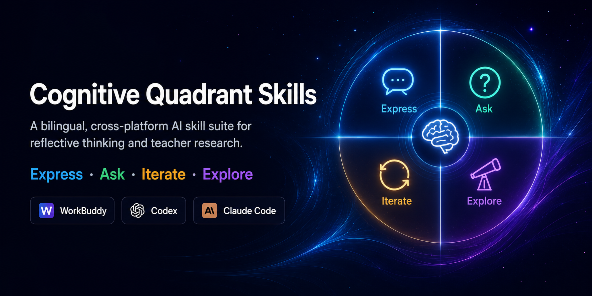
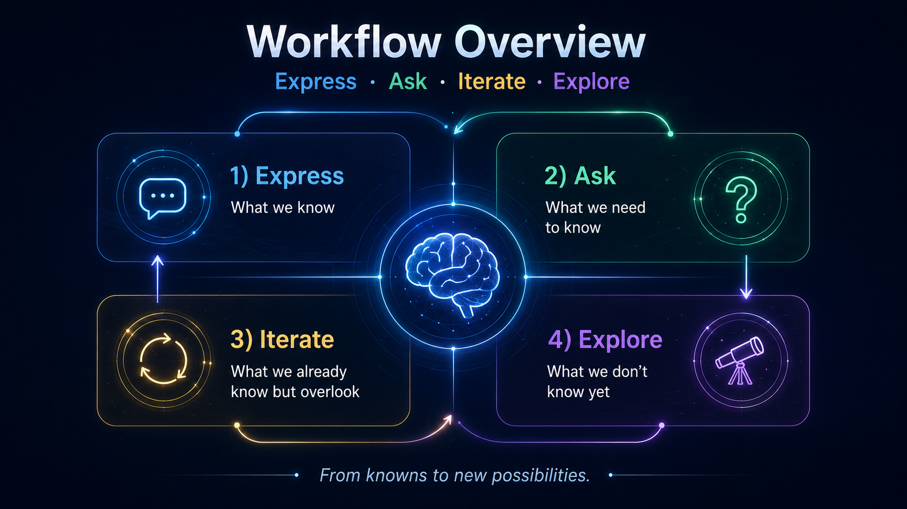
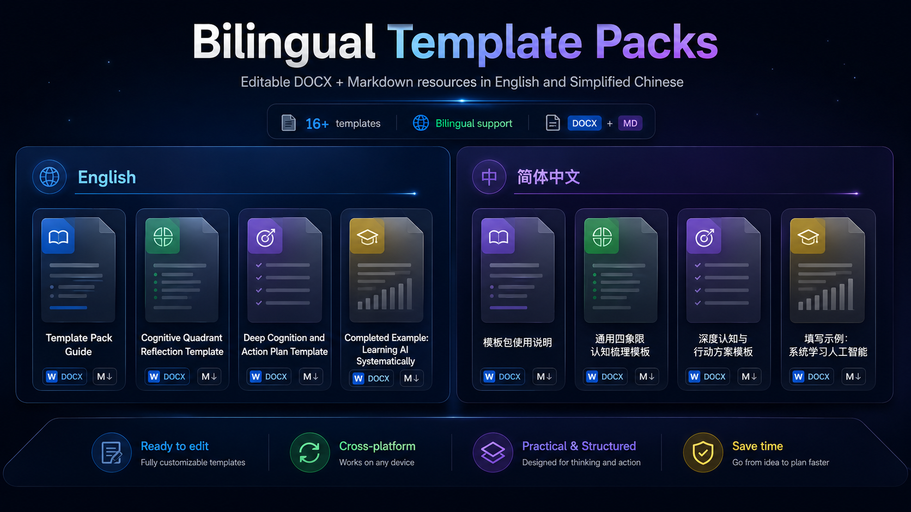

<p align="center">
  
</p>
# Cognitive Quadrant Skills

**Express · Ask · Iterate · Explore**
## Workflow Overview

<p align="center">
  
</p>
A bilingual, cross-platform Agent Skills suite for reflective thinking, knowledge-boundary exploration, and teacher research. Version **1.1.0** uses one platform-neutral core and is packaged for **WorkBuddy, OpenAI Codex, and Claude Code**.

[简体中文说明](README.zh-CN.md)

> Status: the packages follow the documented Skill structures of the three platforms. WorkBuddy, Codex, and Claude Code can expose different tools and permissions, so runtime behavior still depends on the host platform and selected model.

## What is different about this project?

The project does not treat the known–unknown quadrant as a static 2×2 worksheet. It turns the four quadrants into a repeatable cognitive cycle:

1. **Express** — separate facts, experience, judgments, assumptions, constraints, and resources.
2. **Ask** — convert vague uncertainty into questions that can be answered, searched, discussed, or tested.
3. **Iterate** — surface tacit knowledge, hidden assumptions, contradictions, underused evidence, and alternative problem definitions.
4. **Explore** — introduce new perspectives, theories, variables, stakeholders, risks, opportunities, and possible futures.

The intended outcome is not “more AI-generated content.” It is a **better problem definition, an explicit uncertainty map, and a verifiable next step**.

## Included skills

### Cognitive Quadrant — Thinking & Exploration

Folder: [`skills/cognitive-quadrant-general`](skills/cognitive-quadrant-general)

Use it to:

- clarify a complex issue;
- inspect assumptions and blind spots;
- compare options;
- iterate a plan, project, product, or content idea;
- expand understanding with evidence when appropriate;
- create an action plan, editable report, or quadrant summary.

Universal package: [`releases/cognitive-quadrant-general-v1.1.0.zip`](releases/cognitive-quadrant-general-v1.1.0.zip)

### Cognitive Quadrant — Teacher Research & Innovation

Folder: [`skills/cognitive-quadrant-teacher-research`](skills/cognitive-quadrant-teacher-research)

Use it to:

- convert teaching practice into researchable problems;
- refine a topic, question, proposal, paper, or research framework;
- identify evidence gaps and theoretical perspectives;
- distinguish genuine innovation from fashionable wording;
- propose innovation directions with verification paths and risks;
- create editable research reports and evidence tables.

Universal package: [`releases/cognitive-quadrant-teacher-research-v1.1.0.zip`](releases/cognitive-quadrant-teacher-research-v1.1.0.zip)

## Bilingual editable templates

<p align="center">
  
</p>

Both Skills include complete, editable Word template packs in **English** and **Simplified Chinese**. Each language pack contains:

- a template pack guide;
- a cognitive quadrant reflection template;
- a deep analysis template;
- a completed example;
- a Markdown fallback template.

Paths:

- `skills/cognitive-quadrant-general/assets/templates/en/`
- `skills/cognitive-quadrant-general/assets/templates/zh-CN/`
- `skills/cognitive-quadrant-teacher-research/assets/templates/en/`
- `skills/cognitive-quadrant-teacher-research/assets/templates/zh-CN/`

The Word files preserve the same visual system and report logic across both languages.

## Platform compatibility

| Capability | WorkBuddy | Codex | Claude Code |
|---|---|---|---|
| Core `SKILL.md` workflow | Yes | Yes | Yes |
| Automatic matching from `description` | Host-dependent | Yes | Yes |
| Explicit invocation | Skill UI / prompt | `$skill-name` or `/skills` | `/skill-name` |
| User-level installation | Local Skill import | `~/.agents/skills/` | `~/.claude/skills/` |
| Project-level installation | Host-dependent | `.agents/skills/` | `.claude/skills/` |
| WorkBuddy `manifest.yaml` | Used | Ignored | Ignored |
| Codex `agents/openai.yaml` | Ignored | Used when supported | Ignored |
| Web/file/output tools | Depends on host | Depends on configured tools | Depends on permissions/tools |

The extra platform metadata is intentionally non-destructive: each host reads the files it understands and ignores the rest.

## Quick installation

### WorkBuddy

1. Download a universal ZIP from [`releases`](releases).
2. In WorkBuddy, open Skill management and choose the local upload/import option.
3. Upload the ZIP and enable the Skill.

Detailed guide: [`docs/installation-workbuddy.md`](docs/installation-workbuddy.md) · [中文](docs/installation-workbuddy.zh-CN.md)

### Codex

Personal installation:

```bash
mkdir -p ~/.agents/skills
cp -R skills/cognitive-quadrant-general ~/.agents/skills/
cp -R skills/cognitive-quadrant-teacher-research ~/.agents/skills/
```

Or run:

```bash
bash scripts/install-codex.sh
```

Detailed guide: [`docs/installation-codex.md`](docs/installation-codex.md) · [中文](docs/installation-codex.zh-CN.md)

### Claude Code

Personal installation:

```bash
mkdir -p ~/.claude/skills
cp -R skills/cognitive-quadrant-general ~/.claude/skills/
cp -R skills/cognitive-quadrant-teacher-research ~/.claude/skills/
```

Or run:

```bash
bash scripts/install-claude-code.sh
```

Detailed guide: [`docs/installation-claude-code.md`](docs/installation-claude-code.md) · [中文](docs/installation-claude-code.zh-CN.md)

## Example prompts

### General

```text
Use the cognitive quadrant workflow to help me decide whether to change roles. Separate what I know from what I assume, identify the information that could change my decision, surface experience I may be overlooking, explore second-order effects, and propose low-cost tests before I make an irreversible choice.
```

```text
请用认知四象限帮我梳理“是否转岗”这件事。区分事实、感受和假设，找出真正会改变判断的信息，发现我可能忽略的经验与资源，分析长期影响，并提出低成本、可验证的下一步行动。
```

### Teacher research

```text
I have used generative AI in vocational hospitality marketing tasks. Help me transform the practice into a researchable problem. Identify evidence gaps, search for relevant theory when tools are available, revise my assumptions, and propose innovation directions with explicit verification paths.
```

```text
我在高职酒店营销课堂中使用了生成式人工智能，但不知道怎样转化为科研问题。请梳理四象限，识别证据缺口，在工具允许时检索相关理论，迭代我的原有判断，并提出具有验证路径的创新方向。
```

## Design principles

- **Platform-neutral core:** never assume a specific model, web tool, file tool, API, or operating system exists.
- **Language matching:** respond in the user’s language; English and Simplified Chinese workflows are both included.
- **Progressive disclosure:** `SKILL.md` stays focused and loads detailed references only when needed.
- **Evidence awareness:** distinguish verified facts, source-backed interpretations, inferences, hypotheses, and unknowns.
- **Graceful fallback:** if web or file tools are unavailable, continue with uploaded material, clearly label limitations, and produce a verification plan.
- **Action over abstraction:** end with a small number of reversible, observable, and testable next steps.
- **Editable deliverables:** create files only when the host has the capability and the user wants them; never claim a file was generated when it was not.

## Repository structure

```text
cognitive-quadrant-skills/
├── README.md
├── README.zh-CN.md
├── docs/
├── scripts/
├── releases/
└── skills/
    ├── cognitive-quadrant-general/
    │   ├── SKILL.md
    │   ├── manifest.yaml
    │   ├── agents/openai.yaml
    │   ├── references/
    │   ├── examples/
    │   └── assets/
    └── cognitive-quadrant-teacher-research/
        └── ...
```

## Validation

Run:

```bash
python scripts/validate_skills.py
```

The GitHub Actions workflow runs the same structural checks on pushes and pull requests.

## Originality and attribution

This repository **does not claim to have invented** the known–unknown quadrant. Its original contribution is the action-oriented **Express–Ask–Iterate–Explore** workflow, the combination of dialogue, evidence retrieval, cognitive revision, innovation generation, and deliverable design, and the adaptation to Chinese teachers, domestic-model environments, and three Skill hosts.

See [`docs/originality-and-prior-art.md`](docs/originality-and-prior-art.md).

## Limitations

- A Skill can improve process consistency but cannot guarantee factual accuracy, research novelty, or good judgment.
- “Unknown unknowns” are exploration hypotheses, not established facts.
- High-stakes health, legal, financial, or safety decisions require qualified professional review.
- Tool availability and output formats depend on the host platform.

## License

Apache License 2.0. See [`LICENSE`](LICENSE).

## Author

Created and maintained by **Ma Xiao (马潇)**, a hospitality-management educator researching generative AI, teacher development, and vocational education.
